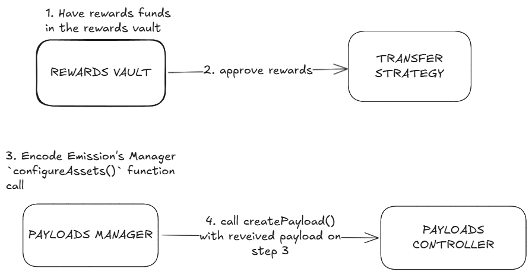

# Liquidity Mining on Aave V3 Example Repository

This repository contains:

- an [example proposal](./src/contracts/AddEmissionAdminPayload.sol) payload which could be used to set up liquidity mining on a governance controlled aave v3 pool
- a [test](./tests/EmissionTestOpOptimism.t.sol) simulating the configuration of certain assets to receive liquidity mining
- a [test](./tests/EmissionConfigurationTestMATICXPolygon.t.sol) simulating the setting up of a new configuration of certain assets after the liquidity mining program has been created

## Instructions to set up new LM program on Aave V3:



1. Make sure the rewards funds that are needed to be distributed for Liquidity Mining are present in the Rewards Vault.

    _Note: The Rewards Vault is your address which contains the reward asset._

2. Do an ERC-20 approve of the total rewards to be distributed to the Transfer Strategy contract, this is a contract by Aave that helps to pull the Liquidity Mining rewards from the Rewards Vault address to distribute to the user. To know more about how a Transfer Strategy contract works you can check [here](https://github.com/aave/aave-v3-periphery/blob/master/docs/rewards/rewards-transfer-strategies.md).

    _Note: The general type of Transfer Strategy contract used for Liquidity Mining is of type PullRewardsStrategy._

3. Encode Emission's Manager `configureAssets()` function call. It takes the array of the following struct to configure liquidity mining for multiple assets for the same reward or multiple assets for multiple rewards.

    _Note: Emission Manager is responsible for configuring emissions of Aave V3. You can interact with it only via the Permissioned Payloads Controller. Permissioned Payloads controller is responsible for storing and executing payloads. It is needed to have a delay between proposal creation and application_

    ```
    abi.encodeWithSelector(EMISSION_MANAGER.configureAssets.selector, [{

      emissionPerSecond: The emission per second following rewards unit decimals.

      totalSupply: The total supply of the asset to incentivize. This should be kept as 0 as the Emissions Manager will fill this up.

      distributionEnd: The end of the distribution of rewards (in seconds).

      asset: The asset for which rewards should be given. Should be the address of the aave aToken (for deposit) or debtToken (for borrow).
      In the case where the asset for reward is for debt token please put the address of stable debt token for rewards in stable borrow mode
      and address of variable debt token for rewards in variable borrow mode.

      reward: The reward token address to be used for Liquidity Mining for the asset.

      transferStrategy: The address of the transfer strategy contract.

      rewardOracle: The Chainlink Aggregator compatible Price Oracle of the reward (used on off-chain infra like UI for price conversion).

    }])
    ```

4. Finally, to create a proposal on the Permissioned Payloads Controller from the Payloads Manager you need to call the `createPayload()` function which will take the payload received in step 3. Before calling `createPayload()` you'll also need to wrap your payload in the following structure. Each field of the structure shouldn't differ from one proposal to another, except the `calldata` field. To know more about how Permissioned payloads controller works you can check [here](https://github.com/bgd-labs/aave-governance-v3/blob/main/docs/permissioned-payloads-controller-overview.md).

    _Note: only a user with the Payloads Manager role can create LM configuration proposals. It's needed to interact with the Permissioned Payloads Controller._

    ```
    PERMISSIONED_PAYLOADS_CONTROLLER.createPayload({

      target - address of Emission Manager.

      withDelegateCall - has to always be false. Otherwise, the Payloads controller won't have permission to configure LM.

      accessLevel - has to always be PayloadsControllerUtils.AccessLevel.Level_1, reverts otherwise.

      value - has to always be 0. Otherwise, the proposal won't be executable.

      string signature - has to always be empty.

      bytes callData - payload received on step 3.
    
    });
    ```

Below is an example with the pseudo-code to create a Liquidity Mining configuration proposal for the variable borrow of `wMatic` with `MaticX` as the reward token for the total amount of `60,000` `MaticX` for the total duration of `6 months`. For a more detailed explanation check out this [test](./tests/PermissionedControllerEmissionTestMATICXPolygon.t.sol).

1. Make sure the Rewards Vault has a sufficient balance of the MaticX token.

    ```
    IERC20(MATIC_X_ADDRESS).balanceOf(REWARDS_VAULT) > 60000 *1e18
    ```

2. Do an ERC-20 approval from the MaticX token from the Rewards Vault to the transfer strategy contract for the total amount.

    ```
    IERC20(MATIC_X_ADDRESS).approve(TRANSFER_STRATEGY_ADDRESS, 60000 *1e18);
    ```

3. Create a payload with the call of EMISSION_MANAGER.

    ```
    bytes memory payload = abi.encodeWithSelector(EMISSION_MANAGER.configureAssets.selector, [{

      emissionPerSecond: 60000 * 1e18 / (180 days in seconds)

      totalSupply: 0

      distributionEnd: current timestamp + (180 days in seconds)

      asset: Aave Variable Debt Token of wMatic // 0x4a1c3aD6Ed28a636ee1751C69071f6be75DEb8B8

      reward: MaticX Token address // 0xfa68FB4628DFF1028CFEc22b4162FCcd0d45efb6

      transferStrategy: ITransferStrategyBase(STRATEGY_ADDRESS) // 0x53F57eAAD604307889D87b747Fc67ea9DE430B01

      rewardOracle: IEACAggregatorProxy(MaticX_ORACLE_ADDRESS) // 0x5d37E4b374E6907de8Fc7fb33EE3b0af403C7403

    }])
    ```

4. Submit a proposal in the Permissioned Payloads Controller with the Payloads Manager:

    ```
    PERMISSIONED_PAYLOADS_CONTROLLER.createPayload([{
     
      target: EMISSION_MANAGER,
  
      withDelegateCall: false,
  
      accessLevel: PayloadsControllerUtils.AccessControl.Level_1,
  
      value: 0,
  
      signature: "",
  
      calldata: payload

    }])
    ```

## How to update an existing LM program

The process to update the existing LM program is quite similar to the explained LM setup process. The difference from the previous process is that you need to use the `setDistributionEnd()` and `setEmissionPerSecond()` functions instead of the `configureAssets()` function of the Emission Manager. Payloads received after encoding calls of these functions in the same way need to be passed to the `createPayload()` function of the Permissioned Payloads Controller to create a proposal.

## Configuration tools

This repository includes a generator to help you bootstrap the required files for an emission configuration. To generate an LM configuration proposal, you need to run `npm run generate`. It can generate either LM setup or LM update proposal.

As a result you'll receive helper files similar to [PermissionedControllerEmissionTestMATICXPolygon](tests/PermissionedControllerEmissionTestMATICXPolygon.t.sol) and [PermissionedPayloadsControllerAndExecutorDeploy](scripts/EmissionMATICXPolygonConfigurationDeploy.s.sol). The first file is test file, it can help you to validate your configuration. Once the configuration is validated you can deploy your proposal using the second file. All required scripts you'll find inside these files.

To get a full list of available commands, run `npm run generate -- --help`.

## FAQ's:

- Do we need to have and approve the whole liquidity mining reward initially?

  It is generally advisable to have and approve funds for the duration of the next 3 months of the Liquidity Mining Program. However it is the choice of the Payloads Manager to do it progressively as well, as the users accrue rewards over time.

- Can we configure mutiple rewards for the same asset?

  Yes, Liquidity Mining could be configured for multiple rewards for the same asset.

- Why do we need to approve funds from the Rewards Vault to the Aave Transfer Strategy contract?

  This is needed so the Transfer Strategy contract can pull the rewards from the Rewards Vault to distribute it to the user when the user claims them.

- Can I reuse an already deployed transfer strategy?
  Yes, a transfer strategy could be reused if it has already been deployed for the given network (given that you want the rewards vault, rewards admin and the incentives controller to be the same).
- If a transfer strategy does not exist, how do I create one?

      The transfer strategy is an immutable contract which determines the logic of the rewards transfer. To create a new pull reward transfer strategy (most     common transfer strategy for liquidity mining) you could use the

  [PullRewardsTransferStrategy.sol](https://github.com/aave/aave-v3-periphery/blob/master/contracts/rewards/transfer-strategies/PullRewardsTransferStrategy.sol) contract with the following constructor params:

      - `incentivesController`: address of the incentives controller
      - `rewardsAdmin`: address of the incentives controller for access control
      - `rewardsVault`: address of the rewards vault containing the funds for the Liquidity Mining program.

      Example to deploy a transfer strategy can be found [here](./scripts/RewardsConfigHelpers.s.sol).

      _Note: All transfer strategy should inherit from the base contract [TransferStrategyBase.sol](https://github.com/aave/aave-v3-periphery/blob/master/contracts/rewards/transfer-strategies/TransferStrategyBase.sol) and you could also define your own custom transfer                   strategy even with NFT’s as rewards, given that you inherit from the base contract._

- Can we stop the liquidity mining program at any time?

  Yes, the liquidity mining program could be stopped at any moment by the Payloads Manager.
  The duration of the Liquidity Mining program could be increased as well, totally the choice of Payloads Manager.
  To stop the liquidity mining, we can either set the emissions per second to 0 or set the distribution end to the block we wish to stop liquiditiy mining at.

- Can we change the amount of liquidity mining rewards?

  Yes, the liquidity mining rewards could be increased or decreased. To do so, please refer
  [here](https://github.com/bgd-labs/example-liquidity-mining-aave-v3/tree/feat/configure-emissions#how-to-configure-emissions-after-the-lm-program-has-been-created)

### Setup

```sh
cp .env.example .env
forge install
```

### Test

```sh
forge test
```

## Copyright

2022 BGD Labs
